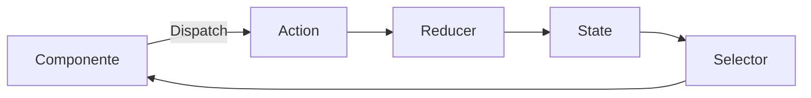

# Angular

El frontend de CryoNova Labs está desarrollado con Angular 19 y funciona como una tienda de producto único para Q-Control Nova, nuestro sistema de control cuántico.

## Estructura del proyecto

Seguimos una arquitectura orientada al producto que facilita la presentación, configuración y adquisición de Q-Control Nova:

```
src/
├── app/
│   ├── core/            # Servicios singleton, autenticación, API
│   ├── shared/          # Componentes, directivas y pipes compartidos
│   ├── product/         # Todo lo relacionado con Q-Control Nova
│   │   ├── overview/    # Vista general del producto
│   │   ├── specs/       # Especificaciones técnicas
│   │   ├── configurator/# Configurador personalizado
│   │   └── pricing/     # Modelos de precio y adquisición
│   ├── checkout/        # Proceso de compra y pedido
│   ├── account/         # Gestión de cuenta de usuario
│   ├── layouts/         # Componentes de layout (shell, header, footer)
│   └── app.module.ts
├── assets/              # Recursos estáticos (imágenes, modelos 3D, documentos)
├── environments/        # Configuración por entorno
└── styles/              # Estilos globales
```

## Angular CLI

Utilizamos Angular CLI para la gestión del proyecto. A continuación, se muestran los comandos más comunes:

```bash
# Crear un nuevo componente
ng generate component product/specs/components/technical-details

# Crear un nuevo servicio
ng generate service core/services/product-config

# Ejecutar la aplicación en modo desarrollo
ng serve

# Compilar para producción
ng build --configuration production

# Ejecutar tests unitarios
ng test
```

## Lazy Loading

Implementamos carga perezosa (lazy loading) para optimizar el tiempo de carga inicial, especialmente importante para visualizaciones 3D y simulaciones del producto:

```typescript
// app-routing.module.ts
const routes: Routes = [
  {
    path: '',
    component: ProductOverviewComponent
  },
  {
    path: 'specs',
    loadChildren: () => import('./product/specs/specs.module')
      .then(m => m.SpecsModule)
  },
  {
    path: 'configurator',
    loadChildren: () => import('./product/configurator/configurator.module')
      .then(m => m.ConfiguratorModule)
  },
  {
    path: 'checkout',
    loadChildren: () => import('./checkout/checkout.module')
      .then(m => m.CheckoutModule),
    canActivate: [AuthGuard]
  },
  // Más rutas...
];
```

## Estado del producto

Utilizamos NgRx para la gestión del estado de configuración del producto y seguimiento del proceso de compra:



Los principales slices del estado incluyen:
- **product**: Información básica del producto y disponibilidad
- **configuration**: Selecciones del usuario en el configurador
- **pricing**: Cálculos de precio según configuración
- **checkout**: Estado del proceso de compra
- **auth**: Estado de autenticación del usuario

## Componentes principales

### Visualizador 3D

Utilizamos Three.js integrado en Angular para proporcionar visualizaciones interactivas del Q-Control Nova:

```typescript
@Component({
  selector: 'app-product-viewer',
  template: `<div class="viewer-container" #container></div>`,
  styles: [`
    .viewer-container {
      height: 400px;
      width: 100%;
      position: relative;
    }
  `]
})
export class ProductViewerComponent implements AfterViewInit {
  @ViewChild('container') container: ElementRef;
  
  ngAfterViewInit() {
    this.initScene();
    this.loadModel('assets/models/q-control-nova.glb');
  }
  
  // Implementación del visualizador 3D...
}
```

### Configurador del producto

Un componente clave que permite a los clientes personalizar el Q-Control Nova según sus necesidades específicas de control cuántico:

```typescript
@Component({
  selector: 'app-product-configurator',
  templateUrl: './product-configurator.component.html'
})
export class ProductConfiguratorComponent {
  channelOptions = [64, 128, 256];
  temperatureOptions = ['4K', '1K', '20mK'];
  latencyOptions = ['Standard (1µs)', 'High performance (0.5µs)'];
  
  @Output() configurationChange = new EventEmitter<ProductConfiguration>();
  
  updateConfiguration() {
    // Lógica para actualizar configuración...
    this.store.dispatch(configActions.update({ config: this.currentConfig }));
  }
}
```

## Integración con backend

Interactuamos con los microservicios mediante HttpClient, centralizando las llamadas API en servicios dedicados:

```typescript
@Injectable({ providedIn: 'root' })
export class ProductService {
  constructor(private http: HttpClient) {}
  
  getProductDetails(): Observable<Product> {
    return this.http.get<Product>('/api/products/q-control-nova');
  }
  
  calculatePrice(config: ProductConfiguration): Observable<PriceDetails> {
    return this.http.post<PriceDetails>('/api/pricing/calculate', config);
  }
  
  placeOrder(order: Order): Observable<OrderConfirmation> {
    return this.http.post<OrderConfirmation>('/api/orders', order);
  }
}
```

## Optimizaciones

Implementamos optimizaciones específicas para mejorar la experiencia del usuario:

- Pre-carga de modelos 3D cuando el usuario entra en la página de producto
- Implementación de PWA para carga instantánea en visitas posteriores
- Caching selectivo de información de producto y precios
- Estrategias de detección de cambios OnPush para componentes visuales complejos
- Renderizado condicional de visualizaciones 3D según capacidades del dispositivo 