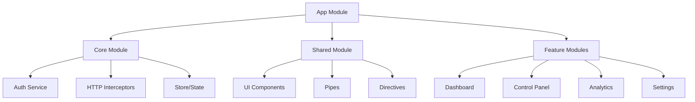

# Frontend Overview

El frontend de CryoNova Labs es una aplicación web moderna desarrollada con Angular 19, Tailwind CSS 4, y configurada como Progressive Web App (PWA) con soporte para internacionalización (i18n).

## Características principales

- **Single Page Application (SPA)**: Experiencia de usuario fluida con navegación sin recarga
- **Progressive Web App (PWA)**: Funcionalidad offline y posibilidad de instalación en dispositivos
- **Internacionalización**: Soporte completo para español e inglés
- **Diseño Responsive**: Adaptación perfecta a diferentes tamaños de pantalla y dispositivos
- **Componentes Reutilizables**: Biblioteca de componentes UI consistentes en toda la aplicación

## Arquitectura 

## Comunicación con el backend

El frontend se comunica con el backend a través del API Gateway YARP mediante:

- Peticiones HTTP/REST para operaciones CRUD estándar
- WebSockets para actualizaciones en tiempo real de los datos de monitorización
- Servidor SSE (Server-Sent Events) para notificaciones y alertas

:::tip Estrategia de caché
Utilizamos una estrategia avanzada de caché que combina:
- Service Workers para recursos estáticos
- IndexedDB para datos de referencia
- Memory caché para datos de uso frecuente
:::

## Diseño de UI/UX

La interfaz de usuario sigue los principios de diseño de CryoNova Labs:

- Paleta de colores: primario (#5C1FFF), secundario (#0C0C0D), blanco (#FFFFFF)
- Tipografía: Inter Display para títulos y texto
- Espaciado consistente basado en múltiplos de 4px
- Componentes accesibles (WCAG AA)

## Tecnologías utilizadas

| Tecnología | Versión | Propósito |
|------------|---------|-----------|
| Angular | 19.x | Framework principal |
| TypeScript | 5.3.x | Lenguaje de programación |
| Tailwind CSS | 4.x | Framework CSS |
| RxJS | 8.x | Programación reactiva |
| NgRx | 18.x | Gestión de estado |
| Angular Material | 20.x | Componentes UI base |
| Workbox | 8.x | PWA/Service Workers |
| Jest | 30.x | Testing unitario |
| Cypress | 14.x | Testing E2E |

## Rendimiento

El frontend está optimizado para ofrecer métricas de rendimiento excepcionales:

- Time to Interactive (TTI) menos de 1.5s
- First Contentful Paint (FCP) menos de 1s
- Performance score > 90 (Lighthouse)
- Bundle size menos de 250KB (gzipped) 