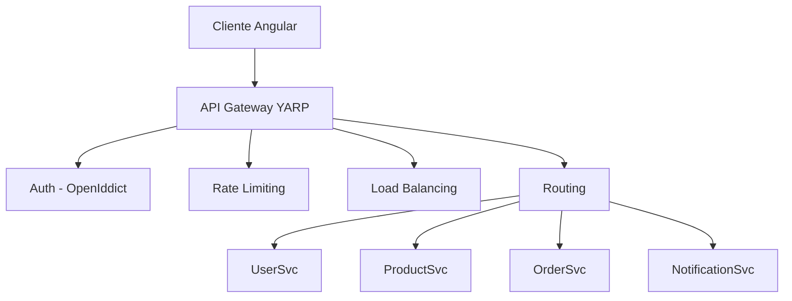
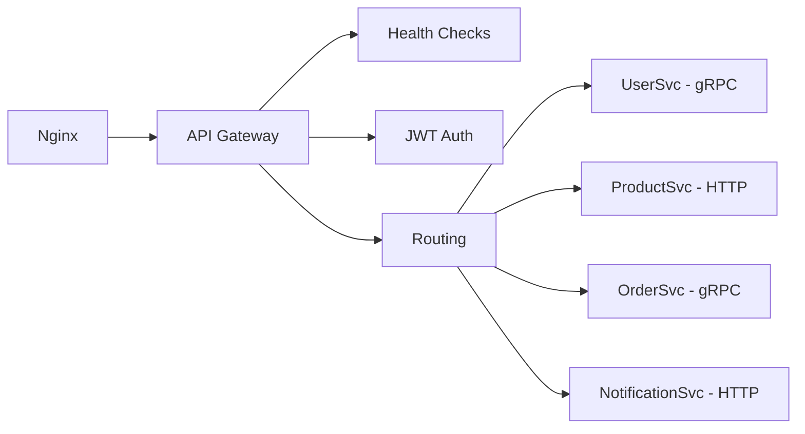

# API Gateway YARP

CryoNova Labs utiliza YARP (Yet Another Reverse Proxy) como API Gateway para gestionar todas las comunicaciones entre el frontend y los diferentes microservicios del backend. YARP es un proyecto de código abierto de Microsoft, desarrollado en .NET.

## ¿Qué es YARP?

YARP es un reverse proxy de alto rendimiento desarrollado en .NET que facilita la implementación de patrones de API Gateway y BFF (Backend For Frontend). Algunas características destacadas:

- **Alto rendimiento**: Optimizado para escenarios de alta concurrencia
- **Extensible**: Permite personalizar el comportamiento mediante middleware
- **Compatible con .NET**: Integración nativa con el ecosistema .NET
- **Ligero**: Mínimo overhead en comparación con otras soluciones

## Arquitectura

Nuestro API Gateway actúa como punto de entrada único para todas las solicitudes desde el frontend, gestionando aspectos como:



## Funciones principales

### Enrutamiento unificado

El API Gateway proporciona un único punto de entrada para todas las API, simplificando la arquitectura desde la perspectiva del cliente:

- **Endpoint único**: `https://api.cryonova-labs.com`
- **Mapeo a servicios internos**: Redirección transparente al microservicio adecuado
- **Versionado de API**: Soporte para múltiples versiones de API simultáneas

### Seguridad centralizada

Implementamos toda la lógica de autenticación y autorización en el gateway:

- **JWT Authentication**: Validación de tokens emitidos por OpenIddict
- **API Key Authentication**: Para integraciones con servicios externos
- **Rate Limiting**: Protección contra ataques de fuerza bruta y DoS
- **IP Filtering**: Restricción de acceso por IP para endpoints sensibles

### Transformación y agregación

El gateway realiza transformaciones sobre las respuestas de los servicios:

- **Transformación de respuestas**: Formateo consistente de todas las API
- **Agregación de datos**: Composición de respuestas de múltiples servicios
- **Mapeo de errores**: Estandarización de mensajes de error

### Observabilidad

Proporcionamos capacidades avanzadas de monitorización:

- **Logging centralizado**: Registro unificado de todas las solicitudes
- **Distributed Tracing**: Seguimiento de solicitudes a través de los servicios
- **Métricas de rendimiento**: Latencia, tasa de éxito, volumen de tráfico

## Diagrama de despliegue



## Configuración

La configuración del gateway se realiza principalmente a través de archivos JSON:

```json
{
  "ReverseProxy": {
    "Routes": {
      "user-route": {
        "ClusterId": "user-cluster",
        "Match": {
          "Path": "/api/users/{**catch-all}"
        },
        "Transforms": [
          { "PathRemovePrefix": "/api" }
        ]
      },
      "product-route": {
        "ClusterId": "product-cluster",
        "Match": {
          "Path": "/api/products/{**catch-all}"
        },
        "Transforms": [
          { "PathRemovePrefix": "/api" }
        ]
      }
    },
    "Clusters": {
      "user-cluster": {
        "Destinations": {
          "user-service": {
            "Address": "http://usersvc:5000"
          }
        },
        "LoadBalancingPolicy": "RoundRobin"
      },
      "product-cluster": {
        "Destinations": {
          "product-service": {
            "Address": "http://productsvc:5001"
          }
        }
      }
    }
  }
}
```

:::tip Configuración dinámica
Además de la configuración estática, soportamos recargar la configuración en tiempo de ejecución sin reiniciar el servicio.
:::

## Implementación en .NET 10

Nuestro API Gateway está implementado como una aplicación .NET 10 con las siguientes características:

- **Minimal API**: Uso del nuevo modelo de Minimal API para reducir el boilerplate
- **Yarp.ReverseProxy**: Biblioteca principal para las funcionalidades de proxy
- **Health Checks**: Monitorización de salud de los servicios backend
- **Métricas Prometheus**: Exportación de métricas para monitorización

### Ejemplo de código principal

```csharp
var builder = WebApplication.CreateBuilder(args);

// Añadir servicios al contenedor
builder.Services.AddReverseProxy()
    .LoadFromConfig(builder.Configuration.GetSection("ReverseProxy"))
    .AddTransforms<JwtTransformProvider>();

// Autenticación y autorización
builder.Services.AddAuthentication(JwtBearerDefaults.AuthenticationScheme)
    .AddJwtBearer();

builder.Services.AddAuthorization(options =>
{
    options.AddPolicy("AdminOnly", policy =>
        policy.RequireClaim("role", "admin"));
});

// Rate limiting
builder.Services.AddRateLimiter(options =>
{
    options.GlobalLimiter = PartitionedRateLimiter.Create<HttpContext, string>(context =>
    {
        return RateLimitPartition.GetFixedWindowLimiter(
            partitionKey: context.User.Identity?.Name ?? context.Request.Headers.Host.ToString(),
            factory: partition => new FixedWindowRateLimiterOptions
            {
                AutoReplenishment = true,
                PermitLimit = 100,
                QueueLimit = 0,
                Window = TimeSpan.FromMinutes(1)
            });
    });
});

var app = builder.Build();

app.UseAuthentication();
app.UseAuthorization();
app.UseRateLimiter();

// Middleware personalizado para seguimiento
app.Use(async (context, next) =>
{
    // Generar ID de correlación para seguimiento
    if (!context.Request.Headers.TryGetValue("X-Correlation-ID", out var correlationId))
    {
        correlationId = Guid.NewGuid().ToString();
        context.Request.Headers.Add("X-Correlation-ID", correlationId);
    }
    
    await next();
});

app.MapReverseProxy(proxyPipeline =>
{
    proxyPipeline.Use((context, next) =>
    {
        // Personalizar pipeline de proxy
        return next();
    });
});

app.Run();
```

## Despliegue

El API Gateway se despliega como un servicio systemd en nuestra infraestructura Linux:

```ini
[Unit]
Description=CryoNova Labs API Gateway
After=network.target

[Service]
Type=notify
WorkingDirectory=/opt/cryonova/gateway
ExecStart=/usr/bin/dotnet CryoNova.Gateway.dll
Restart=always
RestartSec=10
KillSignal=SIGINT
SyslogIdentifier=cryonova-gateway
User=cryonova
Environment=ASPNETCORE_ENVIRONMENT=Production
Environment=ASPNETCORE_URLS=http://+:5000

[Install]
WantedBy=multi-user.target
``` 