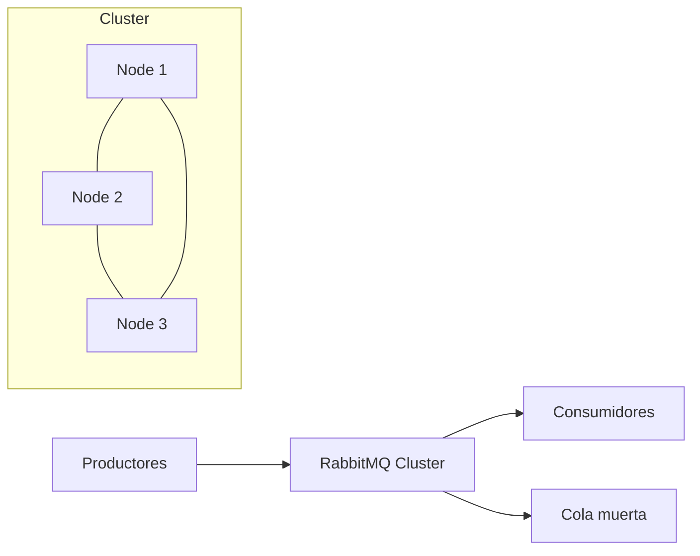
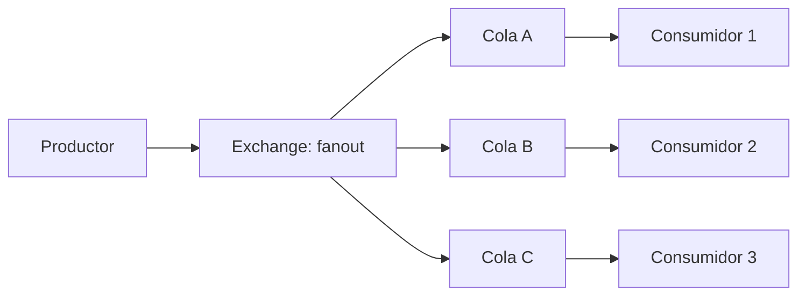
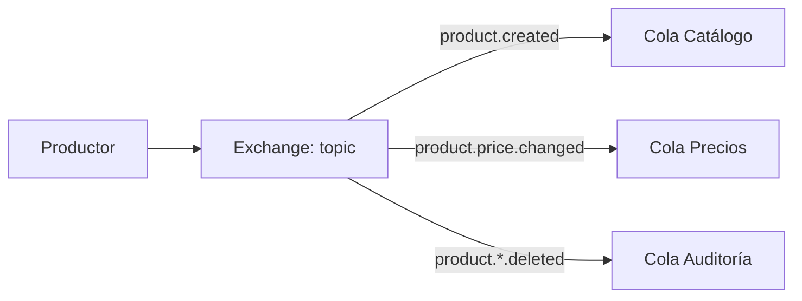
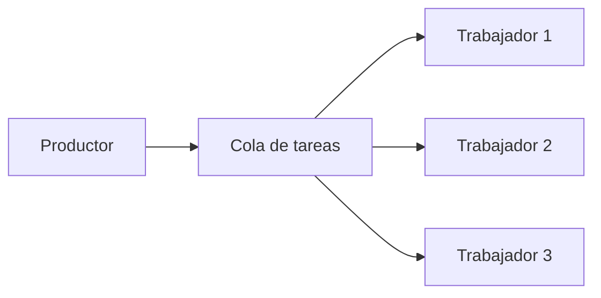

# RabbitMQ

CryoNova Labs utiliza RabbitMQ como broker de mensajería para la comunicación asíncrona entre microservicios. Esta infraestructura de mensajería es fundamental para garantizar la fiabilidad, escalabilidad y desacoplamiento de nuestros sistemas.

## Arquitectura

Utilizamos RabbitMQ 3.13 en una configuración de clúster con 3 nodos para alta disponibilidad. La arquitectura general es la siguiente:



## Patrones de mensajería

Implementamos varios patrones de mensajería para diferentes casos de uso:

### Publicación/Suscripción

Utilizado para eventos de dominio donde múltiples servicios necesitan reaccionar al mismo evento.



### Enrutamiento por tema

Utilizado para filtrar mensajes según patrones específicos.



### Cola de trabajo

Utilizado para distribuir tareas entre múltiples trabajadores.



## Configuración

### Configuración de alta disponibilidad

Nuestro clúster RabbitMQ está configurado con las siguientes características:

- **Mirroring de colas**: Todas las colas se replican en al menos 2 nodos
- **Lazy queues**: Para mensajes de gran tamaño o volumen
- **Quorum queues**: Para mensajes críticos que requieren consistencia

```ini
# Ejemplo de configuración para un nodo
[
  {rabbit, [
    {tcp_listeners, [5672]},
    {hipe_compile, false},
    {vm_memory_high_watermark, 0.6},
    {vm_memory_high_watermark_paging_ratio, 0.8},
    {disk_free_limit, "1GB"}
  ]},
  {rabbitmq_management, [
    {listener, [{port, 15672}]}
  ]},
  {rabbitmq_prometheus, [
    {tcp_config, [{port, 15692}]}
  ]}
].
```

### Políticas de colas

Aplicamos diferentes políticas según el tipo de cola:

```bash
# Colas de eventos de dominio (con replicación)
rabbitmqctl set_policy ha-domain-events "^domain-events\." \
    '{"ha-mode":"exactly","ha-params":2,"ha-sync-mode":"automatic"}' \
    --priority 1 --apply-to queues

# Colas de comandos (con TTL)
rabbitmqctl set_policy ttl-commands "^commands\." \
    '{"message-ttl":3600000}' \
    --priority 1 --apply-to queues
```

## Gestión de errores

### Dead Letter Exchange

Configuramos un Dead Letter Exchange (DLX) para capturar mensajes que no pueden ser procesados:

```csharp
// Configuración de cola con DLX
var args = new Dictionary<string, object>
{
    {"x-dead-letter-exchange", "dlx"},
    {"x-dead-letter-routing-key", "failed-messages"}
};

channel.QueueDeclare(
    queue: "my-queue",
    durable: true,
    exclusive: false,
    autoDelete: false,
    arguments: args);
```

### Reintentos con backoff exponencial

Implementamos una estrategia de reintentos con backoff exponencial para manejar fallos transitorios:

```csharp
// Política de reintentos
var retryPolicy = Policy
    .Handle<Exception>()
    .WaitAndRetry(
        retryCount: 5,
        sleepDurationProvider: attempt => TimeSpan.FromSeconds(Math.Pow(2, attempt)),
        onRetry: (exception, timeSpan, retryCount, context) =>
        {
            _logger.LogWarning($"Reintento {retryCount} después de {timeSpan.TotalSeconds}s por {exception.Message}");
        });

// Uso de la política
retryPolicy.Execute(() =>
{
    // Código para procesar el mensaje
});
```

## Monitorización

Utilizamos varias herramientas para monitorizar nuestro clúster RabbitMQ:

- **Prometheus + Grafana**: Métricas de rendimiento y alertas
- **RabbitMQ Management Plugin**: Interfaz de usuario para administración
- **Logs centralizados**: Agregación de logs en Elasticsearch

### Métricas clave

| Métrica | Descripción | Umbral de alerta |
|---------|-------------|------------------|
| `rabbitmq_queue_messages` | Número de mensajes en cola | >10000 |
| `rabbitmq_queue_messages_unacknowledged` | Mensajes sin confirmar | >1000 |
| `rabbitmq_node_mem_used` | Uso de memoria | >80% |
| `rabbitmq_channel_consumers` | Número de consumidores | menos de 1 por cola |

## Consideraciones de seguridad

- **TLS para todas las conexiones**: Comunicación cifrada
- **Autenticación con certificados**: Para conexiones entre servicios internos
- **VHOST separados**: Aislamiento por entorno (dev, staging, prod)
- **Permisos granulares**: Cada servicio tiene solo los permisos necesarios

## Buenas prácticas

1. **Mensajes idempotentes**: Diseñar los consumidores para manejar mensajes duplicados
2. **Confirmaciones explícitas**: Usar `ack` solo después de procesar completamente un mensaje
3. **Prefetch count adecuado**: Limitar el número de mensajes que un consumidor recibe a la vez
4. **Persistencia selectiva**: Marcar como persistentes solo los mensajes críticos
5. **Monitorización proactiva**: Alertas tempranas para colas que crecen anormalmente 