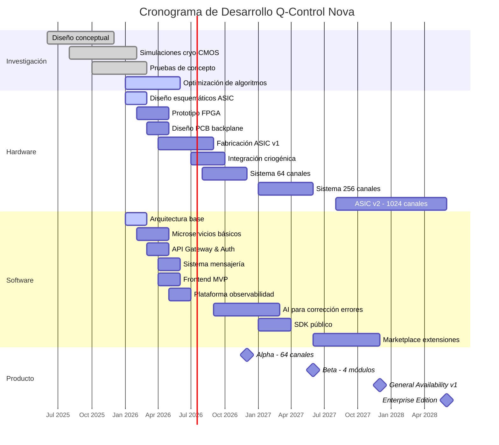

# Roadmap de Q-Control Nova

## Visión Estratégica 2026-2028

Q-Control Nova representa nuestra visión para revolucionar el control de computadores cuánticos, eliminando las barreras actuales de escalabilidad. Este roadmap detalla nuestro plan para los próximos 3 años, con un enfoque en desarrollo incremental, feedback temprano de usuarios y mejora continua.

## Fases de Desarrollo 

### Fase 1: Investigación y Validación (Completado)
Hemos completado la investigación fundamental y validación de conceptos que sustentan Q-Control Nova:

- **Diseño conceptual**: Arquitectura de alto nivel y simulaciones teóricas
- **Simulaciones cryo-CMOS**: Validación de operación a temperaturas de 4K
- **Pruebas de concepto**: Demostración de enlaces fotónicos de alta velocidad en entorno criogénico
- **Optimización de algoritmos**: Implementación de algoritmos QEC (Quantum Error Correction) de baja latencia

### Fase 2: Alpha (Q1-Q4 2026)

#### Hitos Tecnológicos

| Fecha | Hito | Detalles |
|-------|------|----------|
| Marzo 2026 | **Diseño hardware finalizado** | Esquemáticos de ASICs cryo-CMOS y backplane fotónico completos. Arquitectura de 7nm con 64 canales de control por chip. |
| Mayo 2026 | **Prototipo FPGA operativo** | Implementación de algoritmos de control en FPGA Xilinx Ultrascale+ para validación antes de ASIC. Integración con software de calibración. |
| Mayo 2026 | **Backend MVP** | Primera versión funcional de microservicios básicos: UserSvc, ProductSvc, OrderSvc. Arquitectura limpia implementada con .NET 10. |
| Junio 2026 | **Sistema de mensajería operativo** | Implementación completa de RabbitMQ para comunicación entre servicios. Patrones de mensajería documentados y probados. |
| Julio 2026 | **Gateway API y seguridad** | YARP Gateway con autenticación JWT, rate limiting, y routing configurado para todos los microservicios. |
| Agosto 2026 | **Integración criogénica inicial** | Primera prueba de componentes en criostato de dilución a 4K. Validación de interfaces ópticas y comportamiento térmico. |
| Septiembre 2026 | **Fabricación ASIC v1** | Primeros chips ASIC recibidos de la fundición y validados en laboratorio. Implementación hardware de algoritmos QEC. |
| Octubre 2026 | **Frontend Beta** | Interfaz Angular 17 con Tailwind CSS para control y monitorización. Dashboard principales operativos con telemetría en tiempo real. |
| Diciembre 2026 | **Alpha completo 🏆** | Prototipo completo con 64 canales validado con sistema de 20 qubits superconductores. Demostración de reducción de latencia a &lt;1 μs. |

#### Objetivos Alpha

- **Tecnología**: 64 canales de control por módulo a 4K
- **Rendimiento**: Latencia QEC &lt; 1 μs
- **Reducción de cableado**: >90% vs soluciones convencionales
- **Consumo energético**: 80% menos que sistemas actuales
- **Software**: Stack completo con API, microservicios y frontend básico

### Fase 3: Beta (Q1-Q4 2027)

#### Hitos Tecnológicos

| Fecha | Hito | Detalles |
|-------|------|----------|
| Enero 2027 | **Sistema 256 canales en desarrollo** | Integración de 4 ASICs en un único módulo con backplane avanzado. Optimización de disipación térmica. |
| Febrero 2027 | **AI para corrección de errores** | Implementación de modelos ML para optimización automática de parámetros de corrección de errores. |
| Marzo 2027 | **Mejoras de firmware** | Actualización de firmware con soporte para calibración automática y corrección adaptativa. |
| Abril 2027 | **SDK público Beta** | Lanzamiento de SDK para desarrollo de extensiones y control programático. Documentación y ejemplos. |
| Mayo 2027 | **Integración con sistemas existentes** | Adaptadores para sistemas IBM, Google y Rigetti funcionando en entornos de prueba. |
| Junio 2027 | **Beta - 4 módulos 🏆** | Sistema completo con 4 módulos (256 canales) controlando hasta 200 qubits. Pruebas con usuarios beta seleccionados. |
| Agosto 2027 | **Certificaciones iniciales** | Inicio del proceso de certificación CE, FCC, UL para cumplimiento regulatorio. |
| Octubre 2027 | **Producción piloto** | Primera serie de unidades de producción (25 unidades) para validación final. |

#### Objetivos Beta

- **Tecnología**: 256 canales distribuidos en 4 módulos interconectados
- **Usuarios Beta**: 5-10 instituciones de investigación cuántica
- **Software**: Sistema completo de gestión, API pública documentada, herramientas de diagnóstico
- **Feedback**: Programa estructurado de retroalimentación de usuarios, ciclos rápidos de iteración
- **Integraciones**: Compatibilidad con IBM Qiskit, Google Cirq y sistemas abiertos

### Fase 4: Disponibilidad General (Q4 2027 - Q2 2028)

#### Hitos Tecnológicos

| Fecha | Hito | Detalles |
|-------|------|----------|
| Noviembre 2027 | **Certificaciones completadas** | Certificaciones CE, FCC y UL obtenidas para distribución global. |
| Diciembre 2027 | **General Availability v1 🏆** | Lanzamiento oficial de Q-Control Nova. Inicio de ventas y distribución global. |
| Enero 2028 | **Soporte Tier-1** | Equipo de soporte 24/7 para clientes enterprise. SLAs definidos y garantizados. |
| Febrero 2028 | **Academia Q-Control** | Plataforma de aprendizaje con cursos, certificaciones y recursos para usuarios. |
| Abril 2028 | **Marketplace de extensiones** | Lanzamiento de marketplace para componentes, extensiones y servicios de terceros. |
| Junio 2028 | **Enterprise Edition 🏆** | Versión de alta disponibilidad con características de seguridad avanzadas, alta disponibilidad y soporte premium. |

#### Objetivos Generales

- **Producción**: Capacidad de producción de 50+ unidades mensuales
- **Clientes objetivo**: Laboratorios de investigación, empresas de computación cuántica, universidades
- **Soporte**: Documentación completa, programa de entrenamiento y soporte técnico especializado
- **Comunidad**: Portal de desarrolladores, foros, eventos y hackathons

## Próxima Generación (2028+)

### Q-Control Nova XQ (Extreme Quantum)

Nuestra visión para la siguiente generación de Q-Control Nova incluye avances significativos en escala y rendimiento:

| Característica | Especificación Objetivo |
|----------------|-------------------------|
| **Canales de control** | 1024+ por módulo (4x más que v1) |
| **Arquitectura ASIC** | Proceso de 3nm con 50% menos consumo energético |
| **Interfaz** | CXL óptica para latencia ultra-baja (&lt;300ns) |
| **Capacidades avanzadas** | - Corrección de errores multi-capa - Control coherente multi-qubit - Codificación topológica automática |
| **Qubits soportados** | Superconductores, spin, topológicos e híbridos |
| **IA integrada** | Modelos neurales en-chip para optimización en tiempo real |
| **Clusterización** | Soporte para 16+ módulos interconectados (16,000+ canales) |

## Dependencias y Gestión de Riesgos

### Riesgos Identificados

| Riesgo | Probabilidad | Impacto | Mitigación |
|--------|--------------|---------|------------|
| Retrasos en fabricación ASIC | Media | Alto | Versión FPGA como alternativa. Relaciones con múltiples fundiciones. |
| Disponibilidad limitada de sistemas criogénicos | Alta | Medio | Asociaciones con laboratorios nacionales. Inversión en capacidad interna. |
| Dificultades de integración con qubits | Media | Alto | Desarrollo de adaptadores específicos para cada fabricante. |
| Cambios en estándares cuánticos | Media | Medio | Arquitectura modular. Participación activa en comités de estándares. |
| Competencia emergente | Baja | Medio | Protección de IP. Estrategia go-to-market agresiva. Foco en servicio. |

### Dependencias Críticas

:::warning Dependencias externas
- **Acceso a instalaciones criogénicas**: Colaboraciones con 3 laboratorios nacionales aseguradas
- **Fabricación de ASICs**: Contratos con fundiciones confirmados, slots reservados
- **Componentes ópticos especializados**: Acuerdos de suministro con 2 proveedores
- **Sistemas cuánticos para pruebas**: Convenios con IBM y Rigetti establecidos
:::

## Métricas Clave de Éxito

Mediremos el éxito del roadmap utilizando los siguientes KPIs:

1. **Técnicos**
   - Latencia de corrección de errores (&lt;1 μs)
   - Tasa de error en corrección (&lt;0.1%)
   - Reducción de cableado (>95%)
   - Consumo energético (80% reducción vs. sistemas convencionales)

2. **Producto**
   - Tiempo de instalación (&lt3 días)
   - MTBF - Tiempo medio entre fallos (>10,000 horas)
   - Disponibilidad del sistema (>99.9%)

3. **Negocio**
   - Número de unidades desplegadas (objetivo: 100 para fin de 2028)
   - Satisfacción de clientes (NPS >50)
   - Retorno de la inversión para clientes (&lt;18 meses)

## Conclusión

Este roadmap representa nuestra visión y compromiso para transformar el control cuántico durante los próximos 3 años. Q-Control Nova eliminará uno de los principales obstáculos para la computación cuántica a gran escala: el cuello de botella del control clásico.

Nuestro enfoque incremental, comenzando con un sistema de 64 canales y evolucionando hacia los 1024+, nos permitirá validar la tecnología mientras construimos una comunidad activa de usuarios y desarrolladores.

:::tip Participa en nuestra visión
¿Interesado en ser parte de nuestra revolución cuántica? Contacta con nosotros en [partner@cryonova-labs.com](mailto:partner@cryonova-labs.com) para explorar oportunidades de colaboración y acceso anticipado.
::: 