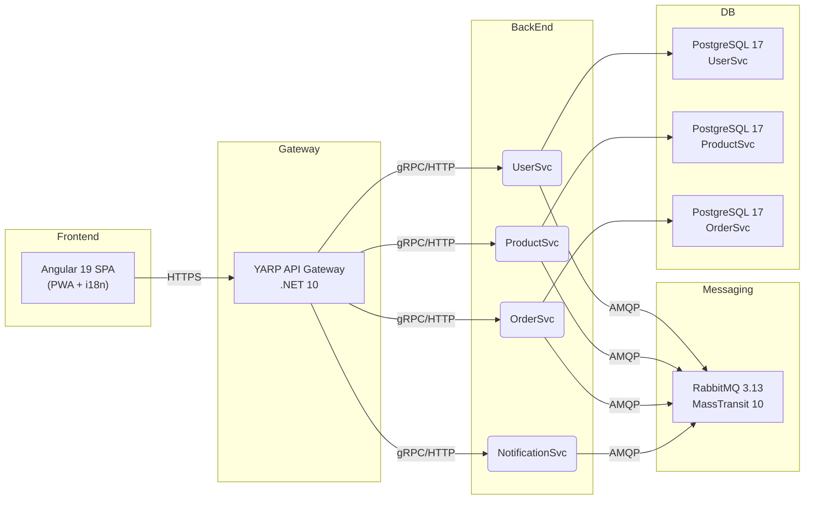

# Stack Tecnológico

La arquitectura de software de CryoNova Labs está diseñada para proporcionar una plataforma robusta y escalable para el control de sistemas cuánticos. A continuación se muestra la estructura general de nuestro stack tecnológico:

## Componentes principales

### Frontend
- **Angular 19**: Framework moderno para desarrollo de SPA
- **Tailwind 4**: Utilidades CSS para diseño consistente y rápido
- **PWA**: Soporte para Progressive Web App con experiencia offline
- **i18n**: Internacionalización multiidioma (ES/EN)

### API Gateway
- **YARP .NET 10**: Gestión centralizada de rutas y seguridad
- **JWT Security**: Autenticación con OpenIddict
- **Rate Limiting**: Protección contra abuso de la API

### Microservicios
- **Platform**: .NET 10 (C#)
- **Comunicación**: Combinación de REST y gRPC
- **Despliegue**: Servicios systemd en Linux

### Base de datos
- **PostgreSQL 17**: Base de datos por microservicio
- **Dapper**: Micro ORM de alto rendimiento para acceso a datos
- **Migraciones**: Gestión automatizada de esquemas con FluentMigrator

### Messaging
- **RabbitMQ 3.13**: Broker de mensajería para comunicación asíncrona
- **MassTransit 10**: Capa de abstracción para mensajería
- **Patrones**: Outbox, retries, y sagas para fiabilidad

## Ventajas del stack

:::tip Beneficios clave
- **Desacoplamiento**: Los microservicios pueden evolucionar independientemente
- **Escalabilidad**: Cada componente puede escalar según sus necesidades
- **Resiliencia**: Fallos aislados no afectan a todo el sistema
- **Observabilidad**: Monitorización completa a nivel de sistema
:::

Esta arquitectura nos permite desarrollar y desplegar rápidamente nuevas características mientras mantenemos un sistema estable y seguro para nuestros usuarios. 