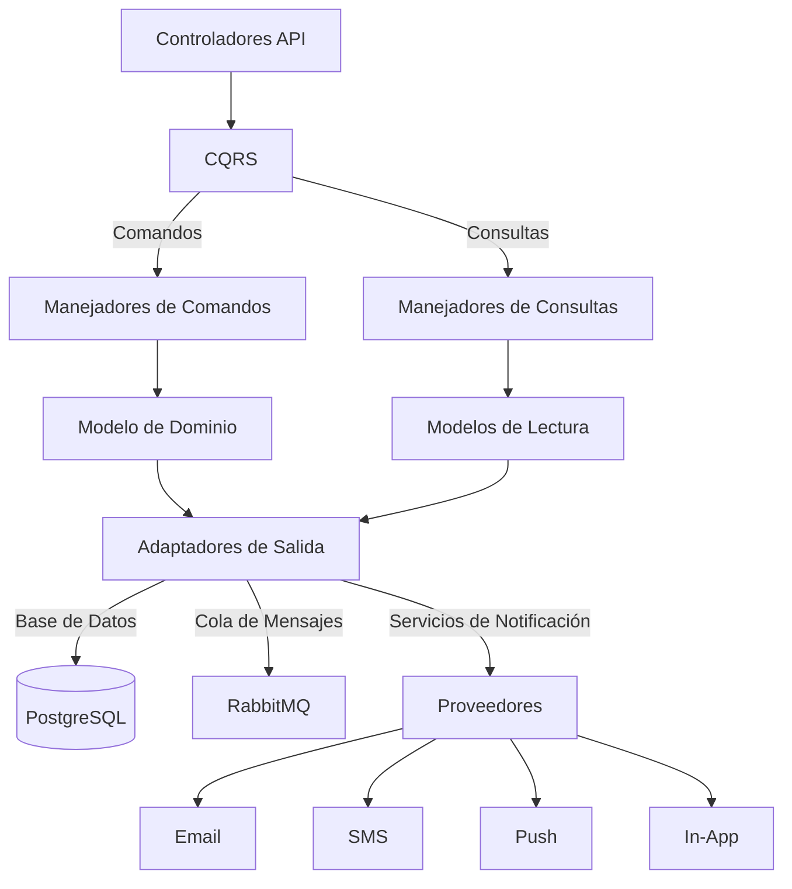

# NotificationSvc

El Servicio de Notificaciones (NotificationSvc) es responsable de gestionar y enviar todas las notificaciones a usuarios a través de múltiples canales como email, SMS, push y mensajes en la aplicación.

## Responsabilidades Principales

NotificationSvc es responsable de:

- **Notificaciones Multicanal**: Envío por email, SMS, push y mensajes en la app
- **Gestión de Plantillas**: Almacenamiento y renderizado de plantillas
- **Notificaciones Programadas**: Envíos diferidos y recurrentes
- **Historial y Seguimiento**: Registro de todas las notificaciones enviadas
- **Preferencias de Usuario**: Configuración de canales por usuario

## Arquitectura

El servicio implementa una arquitectura orientada a eventos con CQRS:

## Modelo de Datos

Entidades principales:

| Entidad | Descripción |
|---------|-------------|
| Notificación | Mensaje principal con contenido y metadatos |
| Plantilla | Estructura reutilizable para notificaciones |
| Canal | Medio de entrega (email, SMS, push, in-app) |
| Historial | Registro de envíos y estados |
| PreferenciaUsuario | Configuración por usuario y tipo |
| ProgramaciónEnvío | Configuración para envíos programados |

## Implementación CQRS

### Comandos
- `EnviarNotificación`: Enviar una notificación inmediata
- `ProgramarNotificación`: Programar para envío futuro
- `CrearPlantilla`: Crear plantilla de notificación
- `ActualizarPlantilla`: Modificar plantilla existente
- `CambiarPreferenciasUsuario`: Actualizar preferencias
- `CancelarNotificaciónProgramada`: Cancelar envío futuro

### Consultas
- `ObtenerHistorialNotificaciones`: Ver historial con filtros
- `ObtenerPlantillas`: Listar plantillas disponibles 
- `VerificarEstadoNotificación`: Consultar estado de envío
- `ObtenerPreferenciasUsuario`: Consultar configuración
- `ListarNotificacionesProgramadas`: Ver envíos futuros

## Endpoints API

### Notificaciones
- `POST /api/notifications`: Enviar notificación
- `GET /api/notifications`: Listar notificaciones con filtros
- `GET /api/notifications/{id}`: Ver detalles de notificación
- `POST /api/notifications/schedule`: Programar notificación
- `DELETE /api/notifications/scheduled/{id}`: Cancelar programada

### Plantillas
- `POST /api/templates`: Crear plantilla
- `GET /api/templates`: Listar plantillas
- `GET /api/templates/{id}`: Obtener plantilla
- `PUT /api/templates/{id}`: Actualizar plantilla
- `DELETE /api/templates/{id}`: Eliminar plantilla

### Preferencias de Usuario
- `GET /api/preferences/{userId}`: Ver preferencias
- `PUT /api/preferences/{userId}`: Actualizar preferencias
- `PUT /api/preferences/{userId}/opt-out`: Darse de baja

## Eventos Publicados

El servicio publica los siguientes eventos en RabbitMQ:

- `NotificaciónEnviada`: Cuando se envía una notificación
- `NotificaciónProgramada`: Cuando se programa una notificación
- `NotificaciónFallida`: Cuando falla el envío de una notificación
- `PlantillaCreada`: Cuando se crea una nueva plantilla
- `PreferenciasActualizadas`: Cuando cambian las preferencias

## Eventos Consumidos

El servicio escucha los siguientes eventos:

- `UsuarioRegistrado` (UserSvc): Para enviar bienvenida
- `PedidoCreado` (OrderSvc): Confirmar nuevo pedido
- `EstadoPedidoActualizado` (OrderSvc): Actualizar sobre pedido
- `PagoRecibido` (PaymentSvc): Confirmar pago procesado
- `ProductoEnOferta` (ProductSvc): Notificar ofertas a usuarios

## Integración con Otros Servicios

- **UserSvc**: Obtención de datos de contacto y preferencias
- **OrderSvc**: Recepción de eventos para notificaciones de pedidos
- **PaymentSvc**: Alertas sobre pagos y facturas
- **ProductSvc**: Notificaciones sobre productos y ofertas

## Tecnologías Utilizadas

- **.NET 10**: Framework base
- **PostgreSQL**: Base de datos principal
- **Dapper**: Micro ORM para acceso a datos
- **RabbitMQ**: Mensajería para eventos
- **Redis**: Caché para plantillas frecuentes
- **SendGrid**: Proveedor de email
- **Twilio**: Proveedor de SMS
- **Firebase**: Notificaciones push

## Escalabilidad y Rendimiento

- Sistema de colas para procesamiento asíncrono
- Agrupación de notificaciones para envío eficiente
- Priorización de mensajes críticos
- Limitación de tasa por usuario y canal
- Escalado horizontal de los workers de procesamiento

## Despliegue

- Despliegue directo en servidores dedicados
- Alta disponibilidad: múltiples instancias
- Copias de seguridad diarias
- Actualizaciones Blue/Green para minimizar tiempo de inactividad

## Monitoreo

- Dashboard de notificaciones enviadas por canal
- Métricas de tasa de entrega y fallos
- Alertas para problemas con proveedores
- Análisis de engagement por tipo de notificación
- Logs estructurados para seguimiento completo