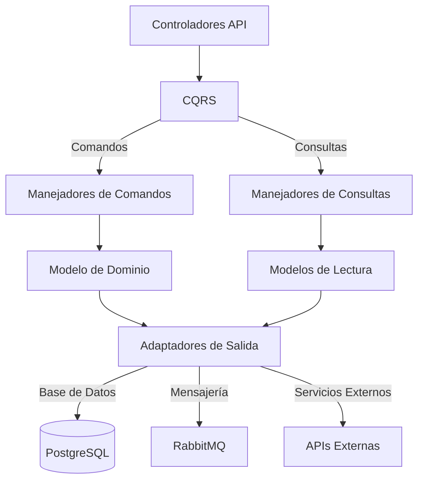

# OrderSvc

El Servicio de Pedidos (OrderSvc) es responsable de gestionar todo el ciclo de vida de los pedidos, desde la creación hasta la entrega, incluyendo integración con pagos e inventario.

## Responsabilidades Principales

OrderSvc es responsable de:

- **Gestión de Pedidos**: Creación, seguimiento y compleción de pedidos
- **Procesamiento de Pagos**: Integración con pasarelas de pago
- **Gestión de Inventario**: Verificación y reserva de existencias
- **Cálculo de Precios**: Aplicación de descuentos y promociones
- **Notificaciones**: Actualización del estado de pedidos

## Arquitectura

El servicio implementa una arquitectura hexagonal con CQRS:

## Modelo de Datos

Entidades principales:

| Entidad | Descripción |
|---------|-------------|
| Pedido | Información principal del pedido |
| LineaPedido | Productos individuales del pedido |
| Cliente | Datos del cliente que realiza el pedido |
| Pago | Información de pagos asociados |
| Envío | Detalles de envío y entrega |
| Transacción | Registro de transacciones financieras |

## Implementación CQRS

### Comandos
- `CrearPedido`: Inicializar un nuevo pedido
- `AgregarProductoAPedido`: Añadir producto al pedido
- `AplicarDescuento`: Aplicar código promocional
- `ProcesarPago`: Procesar pago del pedido
- `CancelarPedido`: Cancelar un pedido
- `MarcarPedidoComoEnviado`: Actualizar estado a enviado

### Consultas
- `ObtenerPedidoPorId`: Consultar pedido por ID
- `ListarPedidosDeCliente`: Obtener pedidos de un cliente
- `ObtenerHistorialDePedidos`: Historial de pedidos con filtros
- `ObtenerEstadísticasPedidos`: Métricas de pedidos
- `VerificarEstadoPago`: Consultar estado de pago

## Flujo de Trabajo de Pedidos

1. **Creación**: Cliente crea pedido con productos
2. **Validación**: Verificación de disponibilidad y precios
3. **Pago**: Procesamiento del pago
4. **Confirmación**: Generación de confirmación y número de pedido
5. **Preparación**: Reserva de inventario
6. **Envío**: Gestión logística y actualización de estado
7. **Entrega**: Confirmación de entrega y cierre

## Endpoints API

### Gestión de Pedidos
- `POST /api/orders`: Crear nuevo pedido
- `GET /api/orders`: Listar pedidos (con filtros)
- `GET /api/orders/{id}`: Obtener detalles de pedido
- `PUT /api/orders/{id}/status`: Actualizar estado de pedido
- `DELETE /api/orders/{id}`: Cancelar pedido

### Líneas de Pedido
- `POST /api/orders/{id}/items`: Añadir producto a pedido
- `DELETE /api/orders/{id}/items/{itemId}`: Eliminar producto de pedido
- `PUT /api/orders/{id}/items/{itemId}/quantity`: Modificar cantidad

### Pagos
- `POST /api/orders/{id}/payments`: Registrar pago
- `GET /api/orders/{id}/payments`: Ver historial de pagos
- `GET /api/orders/{id}/payments/status`: Verificar estado de pago

## Eventos Publicados

El servicio publica los siguientes eventos en RabbitMQ:

- `PedidoCreado`: Cuando se crea un nuevo pedido
- `PedidoActualizado`: Cuando se modifica un pedido
- `PedidoConfirmado`: Cuando se confirma un pedido
- `PedidoCancelado`: Cuando se cancela un pedido
- `PagoRecibido`: Cuando se procesa un pago exitoso
- `PedidoEnviado`: Cuando el pedido sale para entrega
- `PedidoEntregado`: Cuando se confirma la entrega al cliente

## Eventos Consumidos

El servicio escucha los siguientes eventos:

- `InventarioActualizado` (ProductSvc): Actualiza disponibilidad de productos
- `PagoConfirmado` (PaymentSvc): Procesa confirmación de pago
- `PagoRechazado` (PaymentSvc): Maneja pagos fallidos
- `ClienteActualizado` (UserSvc): Actualiza datos de clientes

## Integración con Otros Servicios

- **ProductSvc**: Verificación de disponibilidad y precios
- **PaymentSvc**: Procesamiento y verificación de pagos
- **UserSvc**: Validación de clientes y direcciones
- **NotificationSvc**: Envío de notificaciones sobre estado de pedidos

## Tecnologías Utilizadas

- **.NET 10**: Framework base
- **PostgreSQL**: Base de datos principal
- **Dapper**: Micro ORM para acceso a datos
- **RabbitMQ**: Mensajería para eventos
- **Redis**: Caché para mejorar rendimiento
- **Polly**: Gestión de reintentos y circuit breaker

## Patrones de Resiliencia

- **Circuit Breaker**: Para servicios externos
- **Reintentos con Backoff**: Para operaciones transitorias
- **Bulkhead**: Aislamiento de fallos
- **Timeout**: Limitación de tiempo para operaciones
- **Saga**: Para transacciones distribuidas en el flujo de pedidos

## Despliegue

- Despliegue directo en servidores dedicados
- Alta disponibilidad: múltiples instancias
- Copias de seguridad diarias
- Actualizaciones Blue/Green para minimizar tiempo de inactividad

## Monitoreo

- Seguimiento detallado de cada pedido
- Métricas de rendimiento por etapa
- Alertas para errores en pagos o inventario
- Dashboards de ventas y tiempos de procesamiento 