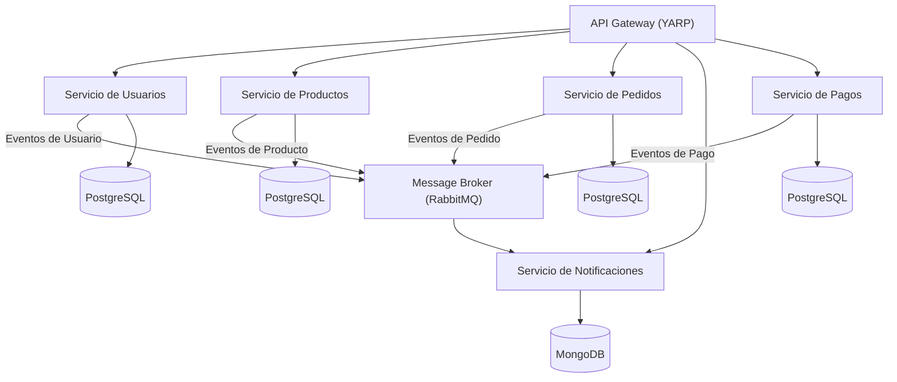

# Arquitectura de Microservicios

El backend de CryoNova está construido sobre una arquitectura de microservicios que proporciona escalabilidad, resiliencia y flexibilidad para soportar nuestros sistemas de control cuántico. Cada microservicio es desplegable de forma independiente y está enfocado en un dominio de negocio específico.

## Visión General de la Arquitectura

Nuestros microservicios están organizados siguiendo los principios de Diseño Dirigido por el Dominio (DDD), con una clara separación de responsabilidades y límites bien definidos entre servicios. La arquitectura enfatiza:

- **Despliegue independiente**: Cada servicio puede actualizarse de forma independiente
- **Resiliencia**: Un fallo en un servicio no afecta al funcionamiento del sistema completo
- **Escalabilidad**: Los servicios pueden escalarse según los patrones de demanda
- **Flexibilidad tecnológica**: Los servicios pueden utilizar las herramientas más apropiadas para sus requisitos específicos

## Servicios Principales

| Servicio | Descripción | Tecnologías |
|---------|-------------|--------------|
| [UserSvc](./user-service) | Gestión de identidad, autenticación y perfiles de usuario | .NET 10, PostgreSQL, Dapper, JWT |
| [ProductSvc](./product-service) | Catálogo de productos, inventario y gestión de configuración | .NET 10, PostgreSQL, Dapper |
| [OrderSvc](./order-service) | Procesamiento, cumplimiento y seguimiento de pedidos | .NET 10, PostgreSQL, Dapper, CQRS |
| [NotificationSvc](./notification-service) | Entrega de notificaciones multicanal (email, SMS, push) | .NET 10, MongoDB, CQRS |
| [PaymentSvc](./payment-service) | Procesamiento de pagos y seguimiento financiero | .NET 10, PostgreSQL, Dapper |

## Patrones de Comunicación

Nuestros microservicios se comunican utilizando una combinación de:

1. **Comunicación Síncrona**: APIs REST y gRPC para comunicación directa entre servicios
2. **Comunicación Asíncrona**: Mensajería basada en eventos a través de RabbitMQ para consistencia eventual

### Arquitectura Dirigida por Eventos

Utilizamos un enfoque basado en eventos para operaciones que:
- Abarcan múltiples servicios
- No requieren consistencia inmediata
- Necesitan mantener un registro de auditoría fiable

Los tipos de eventos clave incluyen:
- Eventos de usuario (UsuarioCreado, UsuarioActualizado)
- Eventos de producto (ProductoAñadido, InventarioActualizado)
- Eventos de pedido (PedidoRealizado, EstadoPedidoCambiado)
- Eventos de pago (PagoRecibido, ReembolsoEmitido)

## Estándares de Desarrollo

Todos los microservicios se adhieren a estos estándares:
- Versionado de API utilizando rutas URL (/api/v1/, /api/v2/)
- Documentación Swagger/OpenAPI
- Logging estructurado con IDs de correlación
- Verificaciones de salud y sondas de disponibilidad
- Contenerización con Docker
- Patrones de manejo de errores consistentes 