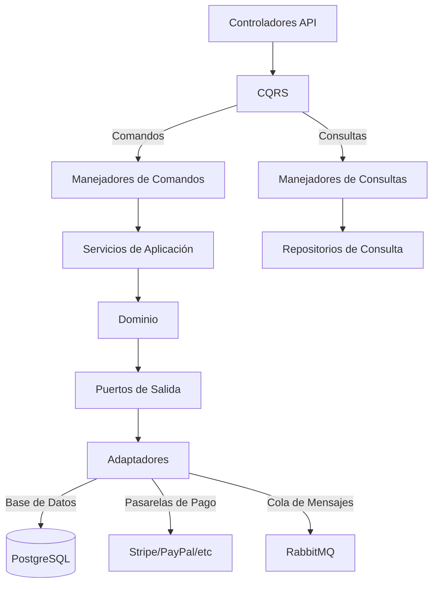

# PaymentSvc

El Servicio de Pagos (PaymentSvc) gestiona todas las transacciones financieras del sistema, incluyendo procesamiento de pagos, reembolsos, facturación y registros financieros.

## Responsabilidades Principales

PaymentSvc es responsable de:

- **Procesamiento de Pagos**: Integración con pasarelas de pago y procesadores
- **Gestión de Reembolsos**: Procesamiento completo o parcial de devoluciones
- **Facturación**: Generación y gestión de facturas para clientes
- **Registros Financieros**: Mantenimiento de transacciones para contabilidad
- **Verificación de Fraude**: Detección de transacciones sospechosas

## Arquitectura

El servicio implementa una arquitectura hexagonal con CQRS y segregación de escritura/lectura:

## Modelo de Datos

Entidades principales:

| Entidad | Descripción |
|---------|-------------|
| Pago | Registro de transacción de pago |
| Método de Pago | Tarjeta, cuenta bancaria u otro método registrado |
| Factura | Documento formal para transacciones |
| Reembolso | Registro de devolución de fondos |
| Transacción | Registro genérico de movimiento financiero |
| Cliente Financiero | Datos fiscales y financieros del cliente |

## Implementación CQRS

### Comandos
- `ProcesarPago`: Ejecutar un nuevo pago
- `AutorizarPago`: Reservar fondos sin capturar
- `CapturarPago`: Confirmar un pago autorizado
- `ProcesarReembolso`: Ejecutar devolución completa o parcial
- `GenerarFactura`: Crear nueva factura
- `AnularTransacción`: Cancelar transacción pendiente
- `ActualizarMétodoPago`: Modificar datos de pago

### Consultas
- `ObtenerHistorialPagos`: Listar pagos con filtros
- `VerDetalleTransacción`: Consultar transacción completa
- `ObtenerFacturas`: Listar facturas disponibles
- `DescargarFactura`: Obtener documento PDF
- `ConsultarEstadoReembolso`: Verificar estado
- `ObtenerMétodosPago`: Listar métodos disponibles
- `ObtenerEstadísticasFinancieras`: Reportes agregados

## Endpoints API

### Pagos
- `POST /api/payments`: Procesar nuevo pago
- `POST /api/payments/authorize`: Autorizar pago
- `POST /api/payments/{id}/capture`: Capturar pago autorizado
- `GET /api/payments`: Listar pagos con filtros
- `GET /api/payments/{id}`: Ver detalles de pago

### Reembolsos
- `POST /api/refunds`: Procesar reembolso
- `GET /api/refunds`: Listar reembolsos
- `GET /api/refunds/{id}`: Ver detalles de reembolso

### Facturas
- `GET /api/invoices`: Listar facturas
- `GET /api/invoices/{id}`: Ver detalles de factura
- `GET /api/invoices/{id}/download`: Descargar factura (PDF)
- `POST /api/invoices/generate`: Generar factura manualmente

### Métodos de Pago
- `GET /api/payment-methods`: Listar métodos de pago
- `POST /api/payment-methods`: Registrar nuevo método
- `DELETE /api/payment-methods/{id}`: Eliminar método

## Eventos Publicados

El servicio publica los siguientes eventos en RabbitMQ:

- `PagoCompletado`: Cuando se completa un pago exitoso
- `PagoFallido`: Cuando un intento de pago falla
- `ReembolsoProcesado`: Cuando se completa un reembolso
- `FacturaGenerada`: Cuando se crea una nueva factura
- `FraudePotencialDetectado`: Cuando se identifica actividad sospechosa
- `MétodoPagoActualizado`: Cuando se modifica un método de pago

## Eventos Consumidos

El servicio escucha los siguientes eventos:

- `PedidoCreado` (OrderSvc): Para procesar el pago inicial
- `PedidoCancelado` (OrderSvc): Para gestionar reembolso automático
- `DevoluciónAprobada` (OrderSvc): Para iniciar reembolso
- `ClienteActualizado` (UserSvc): Para actualizar datos fiscales

## Integración con Pasarelas de Pago

Adaptadores para múltiples proveedores:
- **Stripe**: Procesamiento principal de tarjetas
- **PayPal**: Pagos desde cuentas PayPal
- **Redsys**: Pasarela para bancos españoles
- **Transferencias Bancarias**: Para pagos manuales

## Tecnologías Utilizadas

- **.NET 10**: Framework base
- **PostgreSQL**: Base de datos principal
- **Dapper**: Micro ORM para acceso a datos
- **RabbitMQ**: Sistema de mensajería para eventos
- **Redis**: Caché y bloqueos distribuidos
- **Hangfire**: Procesamiento de trabajos programados
- **Serilog**: Logging estructurado
- **Polly**: Gestión de reintentos y resiliencia

## Seguridad y Cumplimiento

- Encriptación de datos sensibles (PCI DSS)
- Tokenización de información de tarjetas
- Auditoría completa de todas las operaciones
- Cumplimiento con GDPR para datos financieros
- Doble factor para operaciones de alto riesgo
- Sistema de alertas por actividad inusual

## Resiliencia y Recuperación

- Transacciones distribuidas con Sagas
- Reintentos automáticos con backoff exponencial
- Procesamiento asíncrono para operaciones largas
- Circuito breaker para servicios externos
- Estado idempotente para operaciones críticas

## Despliegue

- Despliegue directo en servidores dedicados
- Alta disponibilidad: múltiples instancias
- Copias de seguridad diarias
- Actualizaciones Blue/Green para minimizar tiempo de inactividad

## Monitoreo

- Dashboard financiero en tiempo real
- Alertas en tiempo real para transacciones fallidas
- Monitoreo de tasas de éxito por pasarela
- Detección de anomalías en patrones de pago
- Métricas de rendimiento y latencia
- Logs estructurados con correlación entre servicios