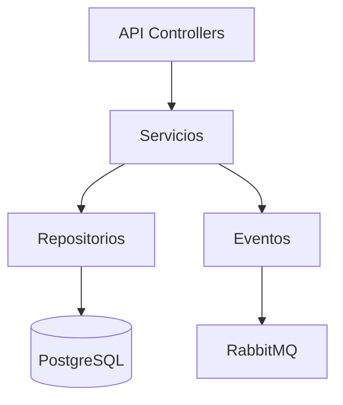

# ProductSvc

El servicio de productos (ProductSvc) gestiona la información centralizada de los productos ofrecidos por CryoNova Labs.

## Responsabilidades principales

El ProductSvc se encarga de:

- **Gestión de información del producto**: Mantenimiento de datos fundamentales del producto
- **Configuraciones**: Administración de configuraciones personalizables para cada producto
- **Especificaciones técnicas**: Gestión de especificaciones detalladas y documentación técnica
- **Precios y disponibilidad**: Control de precios y estado de disponibilidad

## Arquitectura

El servicio implementa una arquitectura simple y directa:

## Modelo de datos

Entidades principales:

| Entidad | Descripción |
|---------|-------------|
| Product | Información básica y estado del producto |
| ProductConfiguration | Opciones y configuraciones disponibles |
| Specification | Detalles técnicos y parámetros |
| PriceHistory | Historial de cambios de precio |

## Implementación CQRS

### Comandos
- `UpdateProductDetails`: Actualizar información básica del producto
- `UpdateProductPrice`: Modificar el precio del producto
- `UpdateProductAvailability`: Cambiar estado de disponibilidad
- `AddProductConfiguration`: Añadir nueva configuración

### Consultas
- `GetProductById`: Obtener información completa del producto
- `GetProductConfigurations`: Listar configuraciones disponibles
- `GetProductSpecifications`: Obtener especificaciones técnicas
- `GetProductPriceHistory`: Consultar historial de precios

## Endpoints API

API RESTful simplificada:

- `GET /api/products`: Listar todos los productos
- `GET /api/products/{id}`: Obtener producto por ID
- `PUT /api/products/{id}`: Actualizar información del producto
- `GET /api/products/{id}/configurations`: Obtener configuraciones
- `POST /api/products/{id}/configurations`: Añadir configuración
- `GET /api/products/{id}/specifications`: Obtener especificaciones

## Eventos publicados

El servicio publica eventos en RabbitMQ cuando:

- Se actualiza información importante del producto
- Cambia el precio del producto
- Cambia la disponibilidad del producto
- Se añade o modifica una configuración

## Tecnologías utilizadas

- **.NET 10**: Framework base
- **PostgreSQL**: Base de datos principal
- **Dapper**: Micro ORM para acceso a datos
- **RabbitMQ**: Mensajería para eventos
- **Polly**: Gestión de reintentos

## Monitorización

- Logs estructurados de cambios en productos
- Alertas para modificaciones críticas
- Seguimiento de actualización de precios 

## Despliegue

- Despliegue directo en servidores dedicados
- Alta disponibilidad: múltiples instancias
- Copias de seguridad diarias
- Actualizaciones Blue/Green para minimizar tiempo de inactividad 