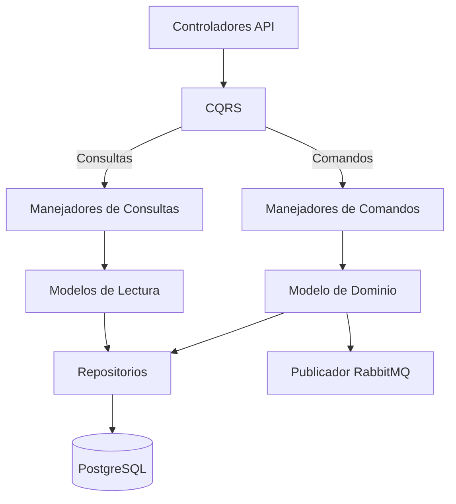

# UserSvc

El Servicio de Usuarios (UserSvc) es responsable de gestionar las identidades de usuario, autenticación y perfiles dentro de la plataforma CryoNova Labs.

## Responsabilidades Principales

UserSvc es responsable de:

- **Gestión de Identidad**: Registro, autenticación y autorización
- **Gestión de Perfiles**: Información de usuario, preferencias y configuraciones
- **Gestión de Sesiones**: Sesiones de inicio y seguridad
- **Control de Acceso**: Permisos y roles de usuario

## Arquitectura

El servicio implementa una arquitectura por capas con el patrón CQRS:

## Modelo de Datos

Entidades principales:

| Entidad | Descripción |
|---------|-------------|
| Usuario | Información central de identidad del usuario |
| Rol | Roles de usuario en el sistema |
| Permiso | Permisos granulares para acciones |
| PerfilUsuario | Datos detallados del perfil de usuario |
| ActividadUsuario | Registro de auditoría de actividades de usuario |

## Implementación CQRS

### Comandos
- `RegistrarUsuario`: Registrar nuevo usuario
- `ActualizarPerfilUsuario`: Actualizar perfil de usuario
- `CambiarContraseña`: Cambiar contraseña de usuario
- `AsignarRol`: Asignar rol a usuario
- `DesactivarUsuario`: Desactivar cuenta de usuario

### Consultas
- `ObtenerUsuarioPorId`: Obtener usuario por ID
- `ObtenerUsuarioPorEmail`: Obtener usuario por email
- `ObtenerUsuariosPorRol`: Listar usuarios por rol
- `ObtenerPermisosUsuario`: Obtener permisos de usuario
- `ObtenerActividadUsuario`: Obtener historial de actividad del usuario

## Endpoints API

API RESTful:

### Autenticación
- `POST /api/auth/login`: Inicio de sesión
- `POST /api/auth/logout`: Cierre de sesión
- `POST /api/auth/password/change`: Cambio de contraseña

### Gestión de Usuarios
- `GET /api/users`: Listar usuarios
- `GET /api/users/{id}`: Obtener usuario por ID
- `POST /api/users`: Crear nuevo usuario
- `PUT /api/users/{id}`: Actualizar usuario
- `DELETE /api/users/{id}`: Eliminar usuario

### Roles y Permisos
- `GET /api/roles`: Listar roles
- `POST /api/roles`: Crear nuevo rol
- `GET /api/users/{id}/permissions`: Obtener permisos de usuario
- `PUT /api/users/{id}/roles`: Asignar roles a usuario

## Eventos Publicados

El servicio publica los siguientes eventos en RabbitMQ:

- `UsuarioRegistrado`: Cuando un nuevo usuario se registra
- `UsuarioActualizado`: Cuando se actualiza información de usuario
- `UsuarioDesactivado`: Cuando se desactiva un usuario
- `RolUsuarioCambiado`: Cuando cambian los roles de usuario
- `IntentoLoginFallido`: Cuando falla el inicio de sesión (para monitoreo de seguridad)

## Eventos Consumidos

El servicio reacciona a los siguientes eventos:

- `PedidoCompletado` (OrderSvc): Actualiza actividad del usuario
- `ProductoComprado` (OrderSvc): Actualiza preferencias del usuario

## Seguridad

- **Hash de Contraseñas**: Argon2id para almacenamiento seguro
- **Autenticación JWT**: Tokens de acceso de corta duración
- **Protección contra Fuerza Bruta**: Limitación de tasa para intentos de inicio de sesión
- **Monitoreo de Actividad**: Detección de actividades sospechosas

## Tecnologías Utilizadas

- **.NET 10**: Framework base
- **PostgreSQL**: Base de datos principal
- **Dapper**: Micro ORM para acceso a datos
- **JWT**: Tokens de autenticación
- **RabbitMQ**: Mensajería para eventos

## Integración con Otros Servicios

- Notifica al NotificationSvc sobre eventos relacionados con usuarios (registro, cambio de contraseña, etc.)
- Consulta al ProductSvc para verificar permisos de acceso a productos específicos

## Estrategia de Despliegue

- Despliegue directo en servidores dedicados
- Alta disponibilidad: múltiples instancias
- Copias de seguridad diarias
- Actualizaciones Blue/Green para minimizar tiempo de inactividad

## Monitoreo

- Monitoreo de intentos de inicio de sesión
- Analíticas de actividad de usuarios
- Detección de anomalías de seguridad
- Métricas de rendimiento para operaciones de autenticación 