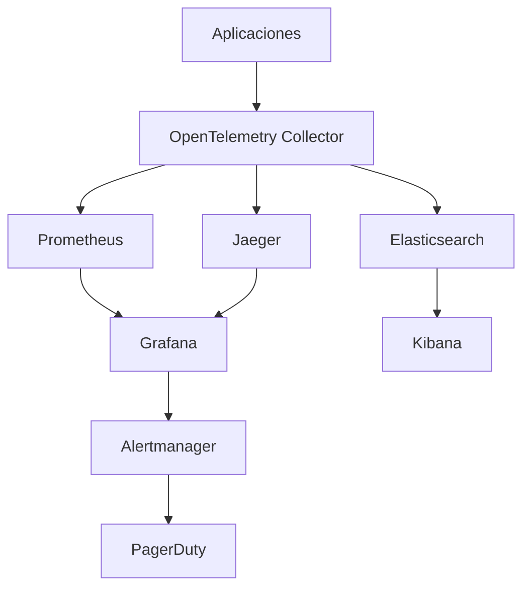

# Observabilidad

La observabilidad es un pilar fundamental en la arquitectura de CryoNova Labs, permitiéndonos entender el estado y comportamiento de nuestros sistemas en producción. Implementamos una estrategia integral que combina logging, métricas y tracing.

## Arquitectura de observabilidad

Nuestra arquitectura de observabilidad se basa en el siguiente stack:



## Logging

### Niveles de log

Utilizamos los siguientes niveles de log de manera consistente en toda la plataforma:

| Nivel | Uso |
|-------|-----|
| ERROR | Errores que requieren intervención inmediata |
| WARN | Situaciones anómalas que no impiden la operación |
| INFO | Información relevante de operaciones normales |
| DEBUG | Información detallada útil para depuración |
| TRACE | Información extremadamente detallada (solo en desarrollo) |

### Estructura de logs

Todos nuestros logs siguen un formato estructurado en JSON con los siguientes campos obligatorios:

```json
{
  "timestamp": "2026-05-01T12:34:56.789Z",
  "level": "INFO",
  "service": "OrderSvc",
  "instance": "orders-pod-1234",
  "traceId": "4bf92f3577b34da6a3ce929d0e0e4736",
  "message": "Pedido procesado correctamente",
  "data": {
    "orderId": "ORD-2026-123456",
    "customerId": "CUST-789",
    "amount": 1250.00
  }
}
```

### Mejores prácticas

- **Contexto suficiente**: Incluir siempre información relevante para entender el log
- **No información sensible**: Nunca incluir contraseñas, tokens o datos personales
- **Rate limiting**: Limitar la cantidad de logs en situaciones de error en cascada
- **Correlación**: Usar IDs de correlación para seguir el flujo de una operación

## Métricas

### Tipos de métricas

Recopilamos cuatro tipos principales de métricas:

1. **Contadores**: Valores que solo aumentan (ej: número de solicitudes)
2. **Gauges**: Valores que suben y bajan (ej: número de conexiones activas)
3. **Histogramas**: Distribución de valores (ej: latencia de respuesta)
4. **Sumarios**: Similar a histogramas pero con cálculos de cuantiles

### Métricas principales

| Métrica | Tipo | Descripción |
|---------|------|-------------|
| `http_requests_total` | Contador | Total de solicitudes HTTP |
| `http_request_duration_seconds` | Histograma | Latencia de solicitudes HTTP |
| `active_connections` | Gauge | Conexiones activas |
| `message_queue_size` | Gauge | Tamaño de la cola de mensajes |
| `database_query_duration_seconds` | Histograma | Duración de consultas a BD |

### Etiquetas (Labels)

Enriquecemos nuestras métricas con etiquetas para permitir dimensiones de análisis:

```
http_requests_total{service="OrderSvc",endpoint="/api/orders",status="200"}
```

Etiquetas comunes:
- `service`: Nombre del servicio
- `instance`: Instancia específica
- `environment`: Entorno (prod, staging, etc.)
- `endpoint`: Endpoint específico
- `status`: Código de estado HTTP

## Tracing distribuido

Utilizamos OpenTelemetry para implementar tracing distribuido que permite seguir el flujo de una solicitud a través de múltiples servicios.

### Estructura de un trace

```
Trace
├── Span (Frontend - Solicitud principal)
│   ├── Span (API Gateway - Autenticación)
│   └── Span (API Gateway - Enrutamiento)
│       ├── Span (ProductSvc - Obtener producto)
│       │   └── Span (ProductSvc - Consulta BD)
│       └── Span (OrderSvc - Crear pedido)
│           ├── Span (OrderSvc - Validar stock)
│           ├── Span (OrderSvc - Reservar producto)
│           └── Span (OrderSvc - Publicar evento)
```

### Propagación de contexto

Propagamos el contexto de tracing a través de los siguientes mecanismos:

- Headers HTTP para comunicación sincrónica
- Cabeceras de mensajes para comunicación asíncrona
- Context local para propagación dentro de un servicio

```csharp
// Ejemplo de middleware que extrae y propaga el contexto
app.Use(async (context, next) =>
{
    var propagator = Propagators.DefaultTextMapPropagator;
    var parentContext = propagator.Extract(default, context.Request.Headers, 
        (headers, key) => headers[key].ToString());
    
    using (var activity = MyActivitySource.StartActivity("ProcessRequest", ActivityKind.Server, parentContext))
    {
        activity?.SetTag("http.method", context.Request.Method);
        activity?.SetTag("http.url", context.Request.Path);
        
        await next();
        
        activity?.SetTag("http.status_code", context.Response.StatusCode);
    }
});
```

## Dashboards y visualización

### Dashboard principal

Nuestro dashboard principal en Grafana muestra:

- Salud general del sistema
- Latencia de endpoints críticos
- Tasas de error
- Uso de recursos
- Métricas de negocio clave

### Alertas

Configuramos alertas basadas en umbrales para diversas métricas:

| Alerta | Condición | Severidad |
|--------|-----------|-----------|
| HighErrorRate | Tasa de error > 5% durante 5 min | Crítica |
| APILatency | Latencia p95 > 500ms durante 10 min | Advertencia |
| QueueBacklog | Cola > 1000 mensajes durante 15 min | Advertencia |
| DiskUsage | Uso de disco > 85% | Advertencia |
| DiskUsage | Uso de disco > 95% | Crítica |

## Herramientas específicas por componente

### Microservicios .NET

```csharp
// Program.cs
var builder = WebApplication.CreateBuilder(args);

// Configuración de telemetría
builder.Services.AddOpenTelemetry()
    .WithTracing(tracerProviderBuilder =>
        tracerProviderBuilder
            .AddSource(ServiceName)
            .SetResourceBuilder(ResourceBuilder.CreateDefault()
                .AddService(ServiceName))
            .AddHttpClientInstrumentation()
            .AddAspNetCoreInstrumentation()
            .AddSqlClientInstrumentation()
            .AddOtlpExporter())
    .WithMetrics(meterProviderBuilder =>
        meterProviderBuilder
            .AddMeter(ServiceName)
            .AddHttpClientInstrumentation()
            .AddAspNetCoreInstrumentation()
            .AddRuntimeInstrumentation()
            .AddOtlpExporter());

// Configuración de logging
builder.Host.UseSerilog((context, services, configuration) => configuration
    .ReadFrom.Configuration(context.Configuration)
    .ReadFrom.Services(services)
    .Enrich.FromLogContext()
    .Enrich.WithProperty("Application", ServiceName)
    .WriteTo.Console(outputTemplate: "[{Timestamp:HH:mm:ss} {Level:u3}] {Message:lj}{NewLine}{Exception}")
    .WriteTo.OpenTelemetry());
```

### Frontend Angular

```typescript
// app.module.ts
import { BrowserModule } from '@angular/platform-browser';
import { NgModule, ErrorHandler } from '@angular/core';
import { HTTP_INTERCEPTORS } from '@angular/common/http';

import { AppComponent } from './app.component';
import { CustomErrorHandler } from './core/error-handler';
import { TelemetryInterceptor } from './core/telemetry.interceptor';

@NgModule({
  declarations: [AppComponent],
  imports: [BrowserModule],
  providers: [
    { provide: ErrorHandler, useClass: CustomErrorHandler },
    { provide: HTTP_INTERCEPTORS, useClass: TelemetryInterceptor, multi: true }
  ],
  bootstrap: [AppComponent]
})
export class AppModule { }
```

## Ambientes y entornos

Mantenemos configuraciones específicas de observabilidad para cada entorno:

- **Desarrollo**: Logs detallados locales, sin métricas ni tracing
- **Testing**: Logs estructurados, métricas básicas, sampling de traces al 50%
- **Staging**: Configuración idéntica a producción
- **Producción**: Logs estructurados, métricas completas, sampling de traces al 10%

## Cultura DevOps

Fomentamos una cultura donde la observabilidad es responsabilidad de todos:

1. **Observabilidad desde el diseño**: Considerar la observabilidad durante el diseño
2. **Democratización de los datos**: Todos los equipos tienen acceso a dashboards
3. **Postmortems sin culpables**: Enfoque en mejoras sistémicas, no en individuos
4. **Monitorización proactiva**: Identificar problemas antes que los usuarios 