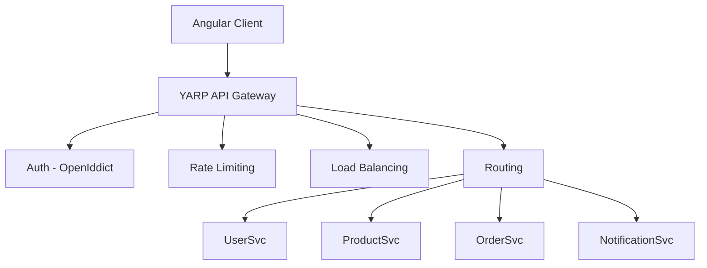
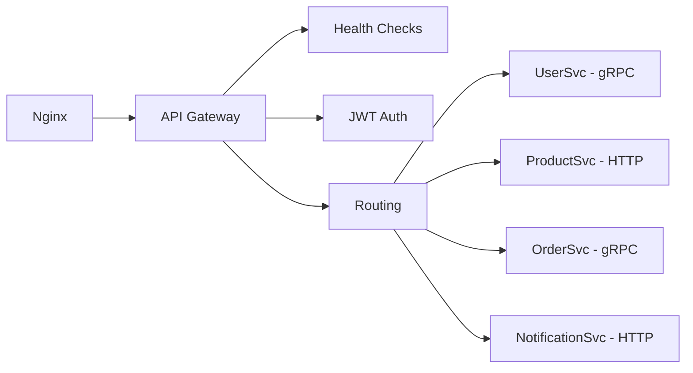

# YARP API Gateway

CryoNova Labs uses YARP (Yet Another Reverse Proxy) as an API Gateway to manage all communications between the frontend and the different backend microservices. YARP is an open-source project from Microsoft, developed in .NET.

## What is YARP?

YARP is a high-performance reverse proxy developed in .NET that facilitates the implementation of API Gateway and BFF (Backend For Frontend) patterns. Some notable features:

- **High performance**: Optimized for high concurrency scenarios
- **Extensible**: Allows customizing behavior through middleware
- **Compatible with .NET**: Native integration with the .NET ecosystem
- **Lightweight**: Minimal overhead compared to other solutions

## Architecture

Our API Gateway acts as a single entry point for all requests from the frontend, managing aspects such as:



## Main Functions

### Unified Routing

The API Gateway provides a single entry point for all APIs, simplifying the architecture from the client's perspective:

- **Single endpoint**: `https://api.cryonova-labs.com`
- **Mapping to internal services**: Transparent redirection to the appropriate microservice
- **API versioning**: Support for multiple simultaneous API versions

### Centralized Security

We implement all authentication and authorization logic in the gateway:

- **JWT Authentication**: Validation of tokens issued by OpenIddict
- **API Key Authentication**: For integrations with external services
- **Rate Limiting**: Protection against brute force and DoS attacks
- **IP Filtering**: IP-based access restriction for sensitive endpoints

### Transformation and Aggregation

The gateway performs transformations on service responses:

- **Response transformation**: Consistent formatting of all APIs
- **Data aggregation**: Composition of responses from multiple services
- **Error mapping**: Standardization of error messages

### Observability

We provide advanced monitoring capabilities:

- **Centralized logging**: Unified logging of all requests
- **Distributed Tracing**: Tracking requests across services
- **Performance metrics**: Latency, success rate, traffic volume

## Deployment Diagram



## Configuration

Gateway configuration is primarily done through JSON files:

```json
{
  "ReverseProxy": {
    "Routes": {
      "user-route": {
        "ClusterId": "user-cluster",
        "Match": {
          "Path": "/api/users/{**catch-all}"
        },
        "Transforms": [
          { "PathRemovePrefix": "/api" }
        ]
      },
      "product-route": {
        "ClusterId": "product-cluster",
        "Match": {
          "Path": "/api/products/{**catch-all}"
        },
        "Transforms": [
          { "PathRemovePrefix": "/api" }
        ]
      }
    },
    "Clusters": {
      "user-cluster": {
        "Destinations": {
          "user-service": {
            "Address": "http://usersvc:5000"
          }
        },
        "LoadBalancingPolicy": "RoundRobin"
      },
      "product-cluster": {
        "Destinations": {
          "product-service": {
            "Address": "http://productsvc:5001"
          }
        }
      }
    }
  }
}
```

:::tip Dynamic Configuration
In addition to static configuration, we support reloading configuration at runtime without restarting the service.
:::

## Implementation in .NET 10

Our API Gateway is implemented as a .NET 10 application with the following features:

- **Minimal API**: Using the new Minimal API model to reduce boilerplate
- **Yarp.ReverseProxy**: Main library for proxy functionality
- **Health Checks**: Monitoring the health of backend services
- **Prometheus Metrics**: Exporting metrics for monitoring

### Main Code Example

```csharp
var builder = WebApplication.CreateBuilder(args);

// Add services to the container
builder.Services.AddReverseProxy()
    .LoadFromConfig(builder.Configuration.GetSection("ReverseProxy"))
    .AddTransforms<JwtTransformProvider>();

// Authentication and authorization
builder.Services.AddAuthentication(JwtBearerDefaults.AuthenticationScheme)
    .AddJwtBearer();

builder.Services.AddAuthorization(options =>
{
    options.AddPolicy("AdminOnly", policy =>
        policy.RequireClaim("role", "admin"));
});

// Rate limiting
builder.Services.AddRateLimiter(options =>
{
    options.GlobalLimiter = PartitionedRateLimiter.Create<HttpContext, string>(context =>
    {
        return RateLimitPartition.GetFixedWindowLimiter(
            partitionKey: context.User.Identity?.Name ?? context.Request.Headers.Host.ToString(),
            factory: partition => new FixedWindowRateLimiterOptions
            {
                AutoReplenishment = true,
                PermitLimit = 100,
                QueueLimit = 0,
                Window = TimeSpan.FromMinutes(1)
            });
    });
});

var app = builder.Build();

app.UseAuthentication();
app.UseAuthorization();
app.UseRateLimiter();

// Custom middleware for tracking
app.Use(async (context, next) =>
{
    // Generate correlation ID for tracking
    if (!context.Request.Headers.TryGetValue("X-Correlation-ID", out var correlationId))
    {
        correlationId = Guid.NewGuid().ToString();
        context.Request.Headers.Add("X-Correlation-ID", correlationId);
    }
    
    await next();
});

app.MapReverseProxy(proxyPipeline =>
{
    proxyPipeline.Use((context, next) =>
    {
        // Customize proxy pipeline
        return next();
    });
});

app.Run();
```

## Deployment

The API Gateway is deployed as a systemd service in our Linux infrastructure:

```ini
[Unit]
Description=CryoNova Labs API Gateway
After=network.target

[Service]
Type=notify
WorkingDirectory=/opt/cryonova/gateway
ExecStart=/usr/bin/dotnet CryoNova.Gateway.dll
Restart=always
RestartSec=10
KillSignal=SIGINT
SyslogIdentifier=cryonova-gateway
User=cryonova
Environment=ASPNETCORE_ENVIRONMENT=Production
Environment=ASPNETCORE_URLS=http://+:5000

[Install]
WantedBy=multi-user.target
``` 