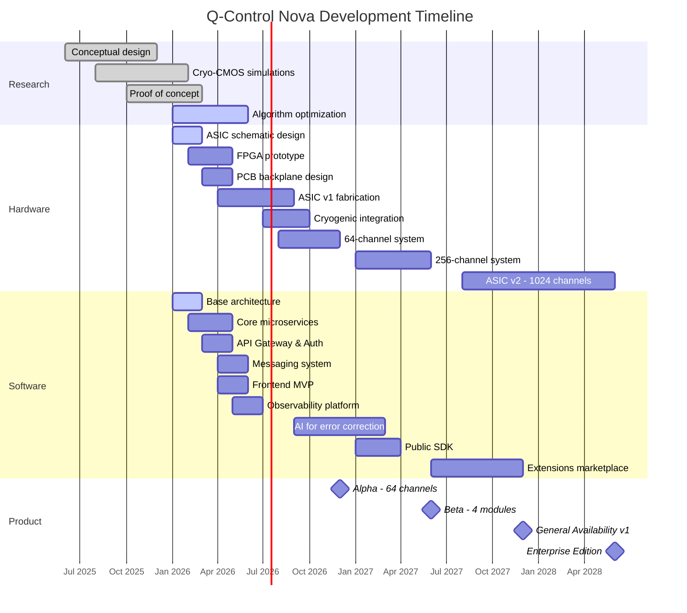

# Q-Control Nova Roadmap

## Strategic Vision 2026-2028

Q-Control Nova represents our vision to revolutionize quantum computer control, eliminating current scalability barriers. This roadmap details our plan for the next 3 years, with a focus on incremental development, early user feedback, and continuous improvement.

## Development Phases

### Phase 1: Research and Validation (Completed)
We have completed the fundamental research and concept validation that supports Q-Control Nova:

- **Conceptual design**: High-level architecture and theoretical simulations
- **Cryo-CMOS simulations**: Validation of operation at 4K temperatures
- **Proof of concept**: Demonstration of high-speed photonic links in cryogenic environment
- **Algorithm optimization**: Implementation of low-latency QEC (Quantum Error Correction) algorithms

### Phase 2: Alpha (Q1-Q4 2026)

#### Technological Milestones

| Date | Milestone | Details |
|-------|------|----------|
| March 2026 | **Hardware design completed** | Cryo-CMOS ASICs and photonic backplane schematics completed. 7nm architecture with 64 control channels per chip. |
| May 2026 | **FPGA prototype operational** | Implementation of control algorithms on Xilinx Ultrascale+ FPGA for validation before ASIC. Integration with calibration software. |
| May 2026 | **Backend MVP** | First functional version of basic microservices: UserSvc, ProductSvc, OrderSvc. Clean architecture implemented with .NET 10. |
| June 2026 | **Messaging system operational** | Complete implementation of RabbitMQ for service communication. Documented and tested messaging patterns. |
| July 2026 | **API Gateway and security** | YARP Gateway with JWT authentication, rate limiting, and routing configured for all microservices. |
| August 2026 | **Initial cryogenic integration** | First component test in dilution cryostat at 4K. Validation of optical interfaces and thermal behavior. |
| September 2026 | **ASIC v1 fabrication** | First ASIC chips received from foundry and validated in laboratory. Hardware implementation of QEC algorithms. |
| October 2026 | **Frontend Beta** | Angular 17 interface with Tailwind CSS for control and monitoring. Main dashboards operational with real-time telemetry. |
| December 2026 | **Alpha complete 🏆** | Complete prototype with 64 channels validated with 20 superconducting qubits system. Demonstration of latency reduction to &lt;1 μs. |

#### Alpha Objectives

- **Technology**: 64 control channels per module at 4K
- **Performance**: QEC latency &lt; 1 μs
- **Wiring reduction**: >90% vs conventional solutions
- **Energy consumption**: 80% less than current systems
- **Software**: Complete stack with API, microservices and basic frontend

### Phase 3: Beta (Q1-Q4 2027)

#### Technological Milestones

| Date | Milestone | Details |
|-------|------|----------|
| January 2027 | **256-channel system under development** | Integration of 4 ASICs in a single module with advanced backplane. Thermal dissipation optimization. |
| February 2027 | **AI for error correction** | Implementation of ML models for automatic optimization of error correction parameters. |
| March 2027 | **Firmware improvements** | Firmware update with support for automatic calibration and adaptive correction. |
| April 2027 | **Public SDK Beta** | Launch of SDK for extension development and programmatic control. Documentation and examples. |
| May 2027 | **Integration with existing systems** | Adapters for IBM, Google and Rigetti systems working in test environments. |
| June 2027 | **Beta - 4 modules 🏆** | Complete system with 4 modules (256 channels) controlling up to 200 qubits. Tests with selected beta users. |
| August 2027 | **Initial certifications** | Start of CE, FCC, UL certification process for regulatory compliance. |
| October 2027 | **Pilot production** | First series of production units (25 units) for final validation. |

#### Beta Objectives

- **Technology**: 256 channels distributed across 4 interconnected modules
- **Beta Users**: 5-10 quantum research institutions
- **Software**: Complete management system, documented public API, diagnostic tools
- **Feedback**: Structured user feedback program, rapid iteration cycles
- **Integrations**: Compatibility with IBM Qiskit, Google Cirq and open systems

### Phase 4: General Availability (Q4 2027 - Q2 2028)

#### Technological Milestones

| Date | Milestone | Details |
|-------|------|----------|
| November 2027 | **Certifications completed** | CE, FCC and UL certifications obtained for global distribution. |
| December 2027 | **General Availability v1 🏆** | Official launch of Q-Control Nova. Start of global sales and distribution. |
| January 2028 | **Tier-1 Support** | 24/7 support team for enterprise customers. Defined and guaranteed SLAs. |
| February 2028 | **Q-Control Academy** | Learning platform with courses, certifications and resources for users. |
| April 2028 | **Extensions marketplace** | Launch of marketplace for third-party components, extensions and services. |
| June 2028 | **Enterprise Edition 🏆** | High-availability version with advanced security features, high availability and premium support. |

#### General Objectives

- **Production**: Production capacity of 50+ units monthly
- **Target customers**: Research laboratories, quantum computing companies, universities
- **Support**: Complete documentation, training program and specialized technical support
- **Community**: Developer portal, forums, events and hackathons

## Next Generation (2028+)

### Q-Control Nova XQ (Extreme Quantum)

Our vision for the next generation of Q-Control Nova includes significant advances in scale and performance:

| Feature | Target Specification |
|----------------|-------------------------|
| **Control channels** | 1024+ per module (4x more than v1) |
| **ASIC architecture** | 3nm process with 50% less energy consumption |
| **Interface** | Optical CXL for ultra-low latency (&lt;300ns) |
| **Advanced capabilities** | - Multi-layer error correction - Multi-qubit coherent control - Automatic topological encoding |
| **Supported qubits** | Superconducting, spin, topological and hybrid |
| **Integrated AI** | On-chip neural models for real-time optimization |
| **Clustering** | Support for 16+ interconnected modules (16,000+ channels) |

## Dependencies and Risk Management

### Identified Risks

| Risk | Probability | Impact | Mitigation |
|--------|--------------|---------|------------|
| ASIC fabrication delays | Medium | High | FPGA version as alternative. Relationships with multiple foundries. |
| Limited availability of cryogenic systems | High | Medium | Partnerships with national laboratories. Investment in internal capacity. |
| Qubit integration difficulties | Medium | High | Development of specific adapters for each manufacturer. |
| Changes in quantum standards | Medium | Medium | Modular architecture. Active participation in standards committees. |
| Emerging competition | Low | Medium | IP protection. Aggressive go-to-market strategy. Focus on service. |

### Critical Dependencies

:::warning External Dependencies
- **Access to cryogenic facilities**: Collaborations with 3 national laboratories secured
- **ASIC fabrication**: Contracts with foundries confirmed, slots reserved
- **Specialized optical components**: Supply agreements with 2 providers
- **Quantum systems for testing**: Agreements with IBM and Rigetti established
:::

## Key Success Metrics

We will measure the success of the roadmap using the following KPIs:

1. **Technical**
   - Error correction latency (&lt;1 μs)
   - Error correction rate (&lt;0.1%)
   - Wiring reduction (>95%)
   - Energy consumption (80% reduction vs. conventional systems)

2. **Product**
   - Installation time (<3 days)
   - MTBF - Mean Time Between Failures (>10,000 hours)
   - System availability (>99.9%)

3. **Business**
   - Number of deployed units (target: 100 by end of 2028)
   - Customer satisfaction (NPS >50)
   - Return on investment for customers (&lt;18 months)

## Conclusion

This roadmap represents our vision and commitment to transform quantum control over the next 3 years. Q-Control Nova will eliminate one of the main obstacles to large-scale quantum computing: the bottleneck of classical control.

Our incremental approach, starting with a 64-channel system and evolving towards 1024+, will allow us to validate the technology while building an active community of users and developers.

:::tip Participate in our vision
Interested in being part of our quantum revolution? Contact us at [partner@cryonova-labs.com](mailto:partner@cryonova-labs.com) to explore collaboration opportunities and early access.
::: 